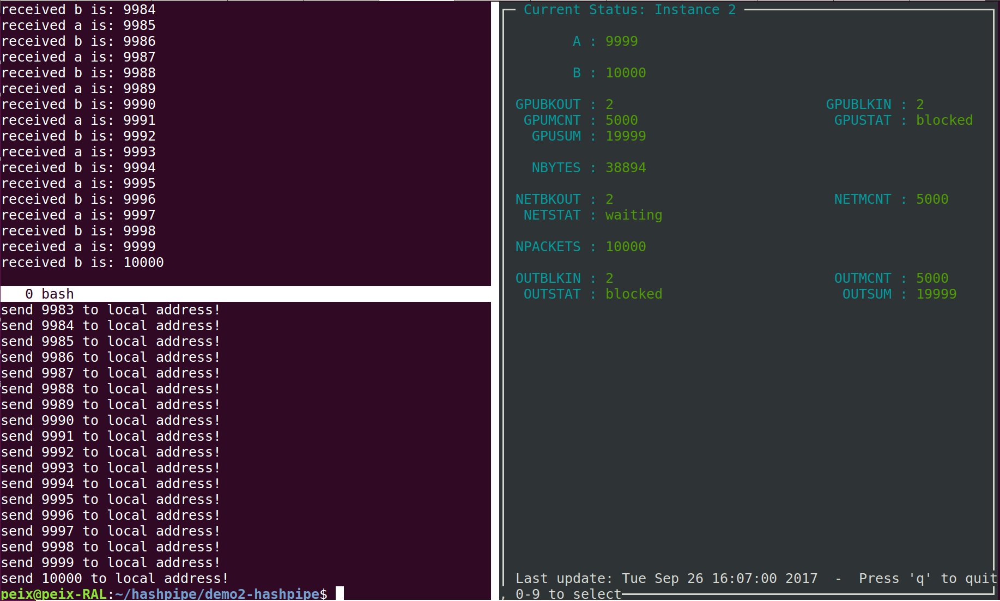

## demo2_hashpipe

In this demo, we will receive the data through Ethernet, the other parts are very similar to demo1. So we just introduce some changes in here. We will send 10000 numbers through local Ethernet, demo2_net_thread will receive 2 numbers each time and put them to an input data buffer. demo2_gpu_thread and demo2_output_thread will process the data in the same way with demo1 do, add them together and write the result to a file.


* demo2_net_thread

To receive the data through Ethernet, we have to configure our IP address and network, we can put this part in an init function:
```
static int init(hashpipe_thread_args_t * args)
{
        hashpipe_status_t st = args->st;
        strcpy(params.bindhost,"127.0.0.1");
        //selecting a port to listen to
        params.bindport = 5009;
        params.packet_size = 0;
        hashpipe_udp_init(&params);
        hashpipe_status_lock_safe(&st);
        hputi8(st.buf, "NPACKETS", 0);
        hputi8(st.buf, "NBYTES", 0);
        hashpipe_status_unlock_safe(&st);
        return 0;

}
```
In the statment of demo2_net_thread, we need to put the init function after init, in this way it will load the function we pointed when the thread starting.
```
static hashpipe_thread_desc_t demo2_net_thread = {
    name: "demo2_net_thread",
    skey: "NETSTAT",
    init: init,
    run:  run,
    ibuf_desc: {NULL},
    obuf_desc: {demo2_input_databuf_create}
};
```
* Installation and running of demo1

	* To install demo2, you only need to tap make & sudo make install. 
	* To run demo, execute ./demo2_init.sh.
	* And then open another window and run ./send_packet.py for packets sending.
	* For status monitor, open another window and tap hashpipe_status_monitor.rb to monitor it. (we can use "screen" command to split the screen to 3 parts.)

Fig. 1 shows how does demo2 looks like.

> Fig. 1 demo2's screen capture
